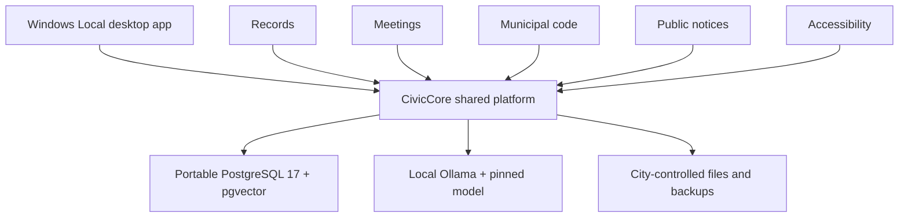

# CivicSuite architecture at a glance

CivicSuite is a multi-repository product family with a one-way dependency rule: product modules depend on CivicCore; CivicCore does not depend on product modules.

## Runtime boundaries

- **Desktop shell:** Tauri with Windows WebView2 is the current clerk-facing operator surface.
- **Shared platform:** CivicCore supplies common identity, audit, retention, ingestion, search, connector, task-queue, and local-AI contracts.
- **Data:** PostgreSQL 17 and pgvector run from portable binaries in the Windows Local package.
- **Services:** module services run through bundled CPython.
- **AI:** a bundled Ollama runtime serves a pinned local model. The model is downloaded and checksum-verified during first-run setup.
- **Modules:** each municipal workflow is maintained in its own repository and pins a compatible CivicCore release.

## Sovereignty boundary

The default runtime is designed around city-controlled hardware and data. No telemetry, vendor cloud dependency, or per-seat metering is part of the default profile. Optional external providers are adapters, not requirements.

Air-gapped operation is an architectural target whose broader verification remains incomplete; it should not be presented as a fully verified operator claim.

## Decision boundary

CivicSuite assists municipal staff. It is not designed to auto-release records, auto-deny requests, auto-redact, auto-enforce, auto-codify, or make legal and compliance determinations. AI drafts; humans decide.

For implementation detail, data-flow rules, and current qualifications, use the authoritative [suite architecture](https://github.com/CivicSuite/civicsuite/blob/main/ARCHITECTURE.md).
